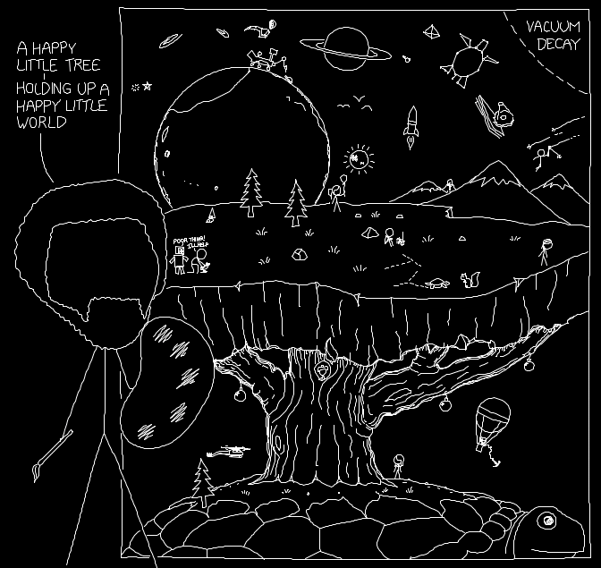

# xkcd2601

This is a project to transcribe xkcd #2601, the April Fools post for 2022, to runnable logo code.

It's done now (sans any bug fixes). Yay!

Many thanks to everyone who contributed to getting this done.

### Running the code:

There are options.

#### jslogo

One of the developers of #2601 [helpfully shared](https://github.com/theinternetftw/xkcd2601/issues/26)
that the logo they used to develop the code was jslogo, which can be found online [here](https://www.calormen.com/jslogo/).
To run the current iteration of the transcription in it, copy/paste the code into the window, then stick a line that says
**xkcd** at the bottom of it all. If the image doesn't fit in your window, add **SETSCRUNCH 0.5 0.5** (or some other decimal)
to the code right before you call xkcd.

This is fun to watch, and renders very nicely, but is slow (at least on my laptop).

#### xkcd 2601 Drawer

Benedikt Werner made a dedicated [xkcd 2601 drawer](https://benediktwerner.github.io/xkcd-2601-drawer/) with a 
zooming/panning feature, which is very fast and loads the latest version of the logo code from this repo. Click the 
"Load latest" and "Draw" buttons, use scroll-up/down to zoom in/out, click-and-drag to pan around.

#### makesvg.py

There's also now a python script to generate an svg, which might be of use.

#### FMSLogo or similar

To quickly run the code again and again to check the commits as they came in, I used
FMSLogo, which is windows only, sadly. But it might also run on your native logo
variant of choice.

To run this code in FMSLogo, open the file, then in the console, type **xkcd**.

### Aiding transcription

The transcription is complete! But if you see anything wrong, please file a bug report!

### Transcription complete!

